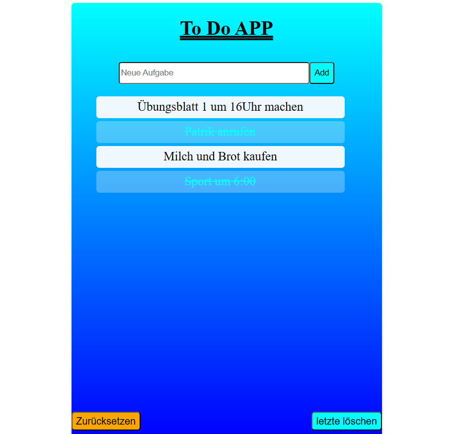

# ToDo App
Mit einem Klick auf `add` oder einem Druck auf der Taste `Enter` fügen Sie neue Aufgaben hinzu, was im input area steht.  
- `zurücksetzen` klicken zum Löschen alle Aufgaben.  
- `letzte löschen` wie gesagt um das am letzten hinzugefügte Element zu löschen.
- Auf Elemente klicken, um sie durchzutreichen. Dient dann als erledigt.

  Zum Testen [👉hier klicken](https://cyvaldez.github.io/ToDo-App/)
## Übersicht

